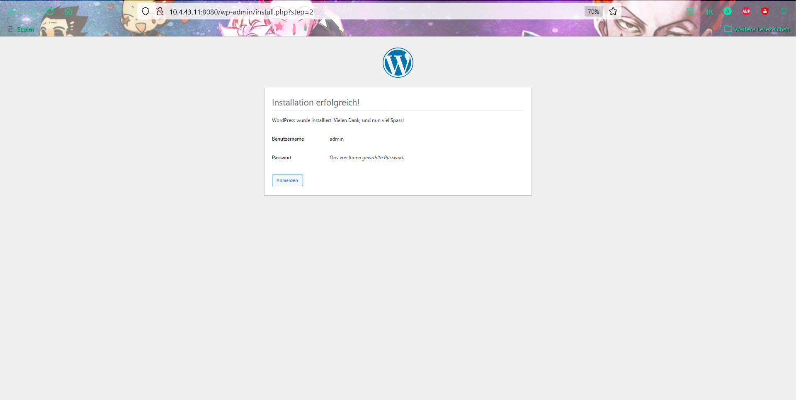

# Einleitung <!-- omit in toc -->
Einleitung zum LB2 Projekt (Erklärungen)

# Inhaltsverszeichnis <!-- omit in toc -->
- [Service-Aufbau](#service-aufbau)
- [Umsetzung](#umsetzung)
  - [Erstellung der Container](#erstellung-der-container)
    - [MySql Server Container erstellen](#mysql-server-container-erstellen)
    - [Wordpress Container erstellen](#wordpress-container-erstellen)
    - [Beenden der Installation in einem Browser](#beenden-der-installation-in-einem-browser)
  - [Images erstellen und auf Docker HUB hochladen](#images-erstellen-und-auf-docker-hub-hochladen)
    - [Account erstellen](#account-erstellen)
    - [Repositories erstellen](#repositories-erstellen)
    - [$ Docker login](#-docker-login)
    - [Images erstellen](#images-erstellen)
    - [Images auf Repo pushen](#images-auf-repo-pushen)
- [Testing](#testing)
- [Fazit](#fazit)
  - [Aqeb Ahmed:](#aqeb-ahmed)
  - [Abi Kani:](#abi-kani)
- [Quellen](#quellen)

## Service-Aufbau
Eine schnelle Wordpress VM
Für schnelle kurze Seiten

## Umsetzung
Zuerst werden wir ein MySQL Container und danach ein Wordpress Container aufsetzen. Wenn wir beide Container aufgesetzt haben, werden wir die Wordpress Installation anfangen und konfigurieren. Wenn all dies gemacht ist, erstellen ein Account in Docker hub, Repositories,  Images von den erstellten Container und verbinden den Docker hub Account (Docker login) mit dem Docker. Zum Schluss werden wir die Images hochladen und diese danach testen.

### Erstellung der Container
Eine erfolgreiche WordPress-Installation besteht aus drei Elementen:

- WordPress-Software
- MySQL- oder MariaDB-Datenbank (Wir werden in diesem Beispiel MySQL verwenden)
- Abschließende Installationsschritte im Browser    durchgeführt

Für die folgenden Beispiele werden die WordPress- und MySQL-Komponenten in separaten verknüpften Containern ausgeführt. Der Container, auf dem die WordPress-Software ausgeführt wird, wird einem Port auf dem Host zugeordnet, sodass Sie in Ihrem Browser darauf zugreifen können.

#### MySql Server Container erstellen
Führen Sie zunächst einen Container namens my-db mit dem Root-Passwort mysql-password aus. 

Starten Sie einen Container mit dem Befehl:

    $ sudo docker run --name my-db -e MYSQL_ROOT_PASSWORD=db-password -d mysql

#### Wordpress Container erstellen
Führen Sie als Nächstes einen Container aus dem offiziellen WordPress-Image aus, der dem Host-Port 8080 zugeordnet und mit dem Datenbankcontainer verknüpft ist.

Zwei Vorbehalte:

- Wenn Sie eine Firewall haben, müssen Sie möglicherweise den Zugriff auf Port 8080 hinzufügen.
- Wenn Sie bereits einen anderen Dienst auf Port 8080 ausführen, können Sie einen anderen Port auf dem Host auswählen.

Der Befehl unterscheidet sich geringfügig, je nachdem, ob Sie MySQL:

Starten Sie den WordPress-Container mit dem folgenden Befehl:

    $sudo docker run --name my-wordpress -p 8080:80 --link my-db:mysql -d wordpress

#### Beenden der Installation in einem Browser

Bei der Installation haben wir folgendes ausgewählt. 

### Images erstellen und auf Docker HUB hochladen
erklärung

#### Account erstellen
Um zu beginnen, müssen Sie ein Docker-Hub-Konto einrichten. Füllen Sie Ihre Kontodaten auf der <a href="http://hub.docker.com/"> Hauptseite von Docker Hub </a> aus und klicken Sie auf Anmelden. 
 
Überprüfen Sie Ihr E-Mail-Konto auf eine Nachricht, um Ihre Kontoaktivierung abzuschließen, und melden Sie sich dann bei der Website an. 
 
Jedes Docker-Hub-Konto kann eine Reihe von kostenlosen öffentlichen Repositories erstellen. Jedes Konto wird auch mit einem kostenlosen privaten Repository geliefert. Sie können gegen eine monatliche Gebühr weitere private Repositories erwerben. 

#### Repositories erstellen
 
 

#### $ Docker login
Damit man die Images später hochladen kann muss man den Docker HUB Account mit dem Docker verbunden sein. Dafür müssen wir den folgenden Befehl eingeben.
    $ docker login
Nach dem Befehl müssen wir die Docker ID eingeben und das Passwort, welches wir für das Docker HUB Account eingeben haben.  
Danach sollte die folgende Meldung kommen.
 

#### Images erstellen

    $ sudo docker commit -m "Added MySQL Login data and Website installation skip" -a "Abi and Aqeb" my-wordpress aqeahm/wordpress:1.0

#### Images auf Repo pushen
    $ docker push aqeahm/wordpress:1.0

## Testing
| Beschreibung  | SOLL | IST | Beweis |
|---|---|---|---|
| --- | --- | --- |  |

## Fazit 
### Aqeb Ahmed:
Ich konnte im Thema Container mein Wissen sehr erweitern. Ich bin immer noch nicht sattelfest, was das Thema angeht,doch im Grossen und Ganzen habe ich es verstanden.

Mit Abi könnte ich auch sehr gut zusammenarbeiten. Es ist nicht unser erstes Projekt welches wir zusammen erlungen. Ich hoffe, dass ich sicherlich wieder einmal mit ihm ein Projekt machen kann und dies auch so erfolgreich wie dieses Projekt abschliessen kann.

### Abi Kani:
ouagudgio

## Quellen
1. https://www.ionos.de/digitalguide/server/knowhow/wordpress-in-docker-containern/
2. https://itler.net/mysql-befehle-uebersicht-die-wichtigsten-datenbank-kommandos-ueber-die-konsole/
3. https://www.ionos.de/digitalguide/server/knowhow/einrichten-eines-docker-repository/
4. https://docs.docker.com/engine/reference/commandline/login/
5. https://www.ionos.de/digitalguide/server/knowhow/docker-images-erstellen/

