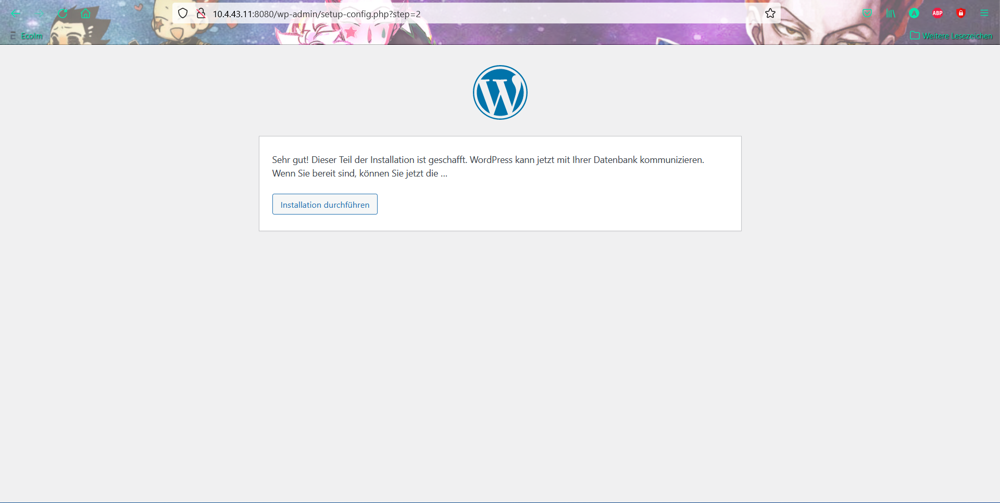

# Einleitung <!-- omit in toc -->
Der Auftrag der LB2 ist es eine Container Umgebung zu realisieren, bei der ein Image Datei erstellt wird, welche man in den Dockerhub uploaded. 
Diese Image wird dann schlussendlich vom Dockerhup gepullt, sodass man eine VM starten kann bei der alles nach der Imagedatei installiert wird.

# Inhaltsverszeichnis <!-- omit in toc -->
- [Service-Aufbau](#service-aufbau)
- [Umsetzung](#umsetzung)
  - [Erstellung der Container](#erstellung-der-container)
    - [MySql Server Container erstellen](#mysql-server-container-erstellen)
    - [Wordpress Container erstellen](#wordpress-container-erstellen)
    - [Beenden der Installation in einem Browser](#beenden-der-installation-in-einem-browser)
  - [Images erstellen und auf Docker HUB hochladen](#images-erstellen-und-auf-docker-hub-hochladen)
    - [Account erstellen](#account-erstellen)
    - [Repositories erstellen](#repositories-erstellen)
    - [$ Docker login](#-docker-login)
    - [Images erstellen](#images-erstellen)
    - [Images auf Repo pushen](#images-auf-repo-pushen)
- [Testing](#testing)
- [Fazit](#fazit)
  - [Aqeb Ahmed:](#aqeb-ahmed)
  - [Abi Kani:](#abi-kani)
- [Quellen](#quellen)

## Service-Aufbau
Eine schnelle Wordpress VM
Für schnelle kurze Seiten

## Umsetzung
Zuerst werden wir ein MySQL Container und danach ein Wordpress Container aufsetzen. Wenn wir beide Container aufgesetzt haben, werden wir die Wordpress Installation anfangen und konfigurieren. Wenn all dies gemacht ist, erstellen ein Account in Docker hub, Repositories,  Images von den erstellten Container und verbinden den Docker hub Account (Docker login) mit dem Docker. Zum Schluss werden wir die Images hochladen und diese danach testen.

### Erstellung der Container
Eine erfolgreiche WordPress-Installation besteht aus drei Elementen:

- WordPress-Software
- MySQL- oder MariaDB-Datenbank (Wir werden in diesem Beispiel MySQL verwenden)
- Abschließende Installationsschritte im Browser    durchgeführt

Für die folgenden Beispiele werden die WordPress- und MySQL-Komponenten in separaten verknüpften Containern ausgeführt. Der Container, auf dem die WordPress-Software ausgeführt wird, wird einem Port auf dem Host zugeordnet, sodass Sie in Ihrem Browser darauf zugreifen können.

#### MySql Server Container erstellen
Führen Sie zunächst einen Container namens my-db mit dem Root-Passwort mysql-password aus. 

Starten Sie einen Container mit dem Befehl:

    $ sudo docker run --name my-db -e MYSQL_ROOT_PASSWORD=db-password -d mysql

#### Wordpress Container erstellen
Führen Sie als Nächstes einen Container aus dem offiziellen WordPress-Image aus, der dem Host-Port 8080 zugeordnet und mit dem Datenbankcontainer verknüpft ist.

Zwei Vorbehalte:

- Wenn Sie eine Firewall haben, müssen Sie möglicherweise den Zugriff auf Port 8080 hinzufügen.
- Wenn Sie bereits einen anderen Dienst auf Port 8080 ausführen, können Sie einen anderen Port auf dem Host auswählen.

Der Befehl unterscheidet sich geringfügig, je nachdem, ob Sie MySQL:

Starten Sie den WordPress-Container mit dem folgenden Befehl:

    $sudo docker run --name my-wordpress -p 8080:80 --link my-db:mysql -d wordpress

#### Beenden der Installation in einem Browser

Bei der Installation haben wir folgendes ausgewählt. 

### Images erstellen und auf Docker HUB hochladen
#### Account erstellen
Um zu beginnen, müssen Sie ein Docker-Hub-Konto einrichten. Füllen Sie Ihre Kontodaten auf der <a href="http://hub.docker.com/"> Hauptseite von Docker Hub </a> aus und klicken Sie auf Anmelden. 
 
Überprüfen Sie Ihr E-Mail-Konto auf eine Nachricht, um Ihre Kontoaktivierung abzuschließen, und melden Sie sich dann bei der Website an. 
 
Jedes Docker-Hub-Konto kann eine Reihe von kostenlosen öffentlichen Repositories erstellen. Jedes Konto wird auch mit einem kostenlosen privaten Repository geliefert. Sie können gegen eine monatliche Gebühr weitere private Repositories erwerben. 

#### Repositories erstellen
 
 

#### $ Docker login
Damit man die Images später hochladen kann muss man den Docker HUB Account mit dem Docker verbunden sein. Dafür müssen wir den folgenden Befehl eingeben.
    $ docker login
Nach dem Befehl müssen wir die Docker ID eingeben und das Passwort, welches wir für das Docker HUB Account eingeben haben.    
Danach sollte die folgende Meldung kommen.
 

#### Images erstellen
Als nächstes speichern Sie den Container als Image mit dem Befehl docker commit, der die folgende Syntax aufweist:
   

     sudo docker commit -m "[build notes]" -a "[creator info]" [container name or ID] [name of image]:[version tag]

- [build notes] = Erstellen Sie Notizen, zum Beispiel eine kurze Erklärung der Änderungen an diesem Image
- [creator info] = Info über Autor: Ihr Name und (falls zutreffend) Ihre Kontaktdaten
- [container name or ID] = Diese Informationen finden Sie mit dem Befehl sudo docker ps -a
- [name of image] =  Geben Sie Ihrem Image einen kurzen, aber anschaulichen Namen (sollte der gleich wie Docker HUB Repositoryname sein)
- Optional: [version tag] = Die Versionsnummer Ihres Images. Sie können entweder eine Nummer angeben (wie v1, v2, v3, etc.) oder Sie können "latest" verwenden. Wenn Sie den Versions-Tag weglassen, wird "latest" angenommen.

In unserem Beispiel werden wir diesen Befehl verwenden:
    
    $ sudo docker commit -m "Added MySQL Login data and Website installation skip" -a "Abi and Aqeb" my-wordpress aqeahm/wordpress:1.0

#### Images auf Repo pushen

    $ docker push aqeahm/wordpress:1.0

## Testing
| Beschreibung  | SOLL | IST | Beweis/Fehler |
|---|---|---|---|
| Images von Docker HUB herunterladen | Es sollte das Image herunterladen ohne welche Probleme | Das Image wurde ohne welche Probleme herunterladen |  |
| Starten von MySQL-Container | Der MySQL-Container sollte mit dem angebenen Hostnamen (my-db) und dem heruntergeladenen Image (aqeahm/db-for-wordpress) gestartet werden. | Es ist auch mit dem angebenen Hostnamen und dem heruntergeladenen Images gestartet |  |
| Starten von Wordpress-Container | Der Wordpress-Container sollte mit dem angebenen Hostnamen (my-wordpress) und dem heruntergeladenen Image (aqeahm/wordpress) gestartet werden. | Leider hat es nicht ganz geklappt wie geplant. Es kam die folgende Fehlermeldung. | `AH00558: apache2: Could not reliably determine the server's fully qualified domain name, using 172.17.0.3. Set the 'ServerName' directive globally to suppress this message` |

## Fazit 
### Aqeb Ahmed:
Ich konnte im Thema Container mein Wissen sehr erweitern. Ich bin immer noch nicht sattelfest, was das Thema angeht,doch im Grossen und Ganzen habe ich es verstanden.

Mit Abi könnte ich auch sehr gut zusammenarbeiten. Es ist nicht unser erstes Projekt welches wir zusammen erledigen. Ich hoffe, dass ich sicherlich wieder einmal mit ihm ein Projekt machen kann.

Beim Projekt hätten wir direkt auf der Wordpress Container den MySQL Datenbank installieren sollen. Damit wird nur eine Container bzw. ein Image als Endprodukt haben. Doch leider hat es am Schluss nicht alles gerreicht um ein Docker Image für das Wordpress korrekt zu erstellen dies sollte man im Kapitel Testing sehen. 

### Abi Kani:
Meiner Meinung nach war es von meiner Leistung her eher einer der schlechteren Modulen. 
Dies lag jedoch überhaupt nicht am Unterricht oder dem behandelten Stoff. Es lag eher am Schulstoff der BMS, da ich dort ein bisschen mehr Gas geben musste, weil es ein bisschen knapp wurde.
Die Themen, die wir in der Schule angeschaut hatten, fand ich spannend. Vorallem auch der Aufbau der Images und Container. Was man alles mit Container-Umgebungen aufbauen konnte, fand ich relativ faszinierend. Das eine kleine Automatisierung, soviel verändern kann, erstaunt mich. Ich finde es sehr schade, dass dies leider unser letztes Modul
bei Herr Calisto ist, bei dem ich in den letzten 3 Jahren sehr viel an Wissen aufgebaut habe und bei dem Ich in meiner Schulzeit mit Abstand am meisten Spass am Unterricht hatte. Die Art und Weise des Unterrichts sollten einige Lehrer übernehmen, welche einen spannenden und unterhaltsamen Unterricht haben möchten.
Jetzt sind die 3 Jahre schon vorbei und es ging um einiges schneller als es mir lieb war.
Danke vielmals für diese Zeit, falls Sie das lesen, Herr Calisto! Oder besser gesagt "Cello"!

## Quellen
1. https://www.ionos.de/digitalguide/server/knowhow/wordpress-in-docker-containern/
2. https://itler.net/mysql-befehle-uebersicht-die-wichtigsten-datenbank-kommandos-ueber-die-konsole/
3. https://www.ionos.de/digitalguide/server/knowhow/einrichten-eines-docker-repository/
4. https://docs.docker.com/engine/reference/commandline/login/
5. https://www.ionos.de/digitalguide/server/knowhow/docker-images-erstellen/
6. https://www.redhat.com/de/topics/containers/what-is-docker

