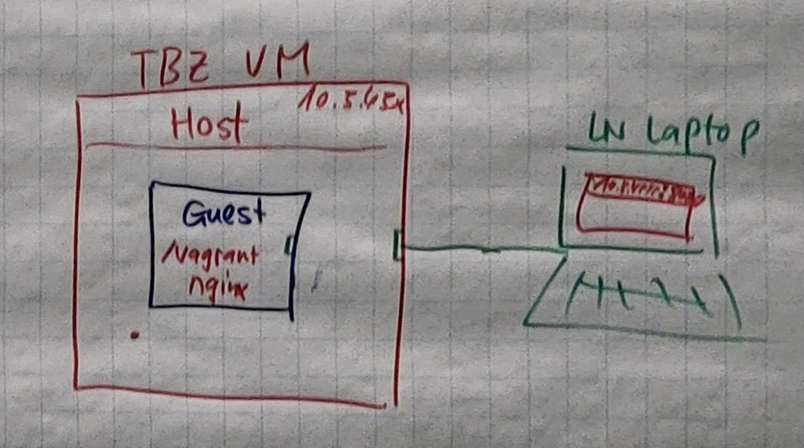

# Einleitung allgemein<!-- omit in toc -->
Einleitung allgemein (Erklärungen zum ganzen M300-Projekt)

# Inhaltsverszeichnis<!-- omit in toc -->
- [Vagrant](#vagrant)
  - [Vagrant Apache2](#vagrant-apache2)
  - [Vagrant Ngnix](#vagrant-ngnix)
- [35-Sicherheit 1](#35-sicherheit-1)
- [30-Container](#30-container)
- [35-Sicherheit 2](#35-sicherheit-2)
- [40-Container-Orchestrierung](#40-container-orchestrierung)
- [50-Add-ons](#50-add-ons)
- [60-Reflexion](#60-reflexion)

## Vagrant

### Vagrant Apache2

### Vagrant Ngnix

Wir mussten auf der TBZ-VM, welcher uns zu geteilt wurde, ein Vagrant Container mit einem Webservice bzw. ngnix installieren. Dabei mussten wir die Daten für die Webseite ausserhalb vom Container speichern, damit man die Daten nicht verliert, wenn man das Container löscht `$ vagrant destroy`  und wieder aufsetzt `$ vagrant up`. Dabei hat mein zwei wichtige Dateien. Das erste wäre das Vagrant-File welches für die Installation veranwortlich ist. In diesem File ist beschrieben, welches Image es installieren soll und ein der Pfad zum Provisioning-File zeigt. Das Provisioning-File ist die andere Datei. Das File ist für die Konfiguration des Container verantwortlich bzw. es ist ein Shellskript 

## 35-Sicherheit 1
Einträge (eigene Erkenntnisse während dem Bearbeiten dieses Kapitels)

## 30-Container
Einträge (eigene Erkenntnisse während dem Bearbeiten dieses Kapitels)

## 35-Sicherheit 2
Einträge (eigene Erkenntnisse während dem Bearbeiten dieses Kapitels)

## 40-Container-Orchestrierung
Einträge (eigene Erkenntnisse während dem Bearbeiten dieses Kapitels)

## 50-Add-ons 
Einträge (eigene Erkenntnisse während dem Bearbeiten dieses Kapitels)

## 60-Reflexion
Lernprozess festgehalten (Form frei wählbar)

- - -
 Dieses Werk ist lizenziert unter einer <a rel="license" href="http://creativecommons.org/licenses/by-nc-sa/3.0/ch/">Creative Commons Namensnennung - Nicht-kommerziell - Weitergabe unter gleichen Bedingungen 3.0 Schweiz Lizenz</a>

- - -
